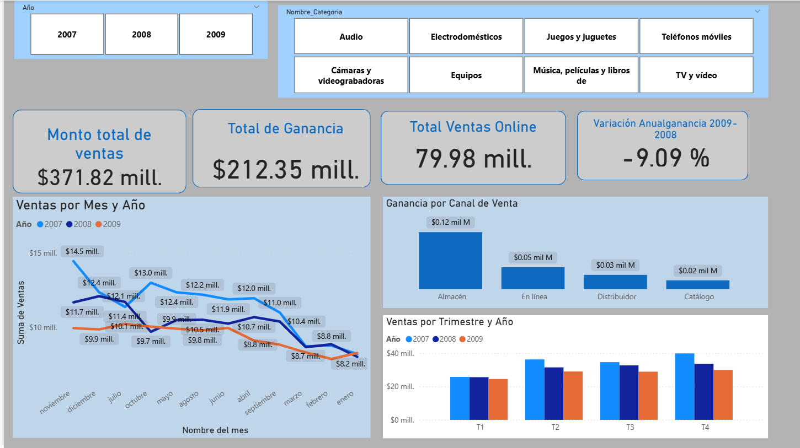
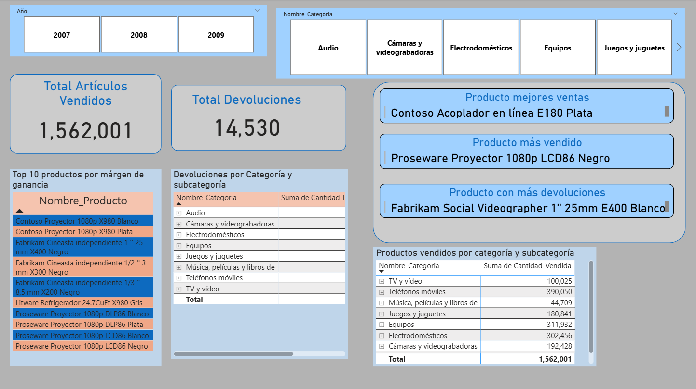
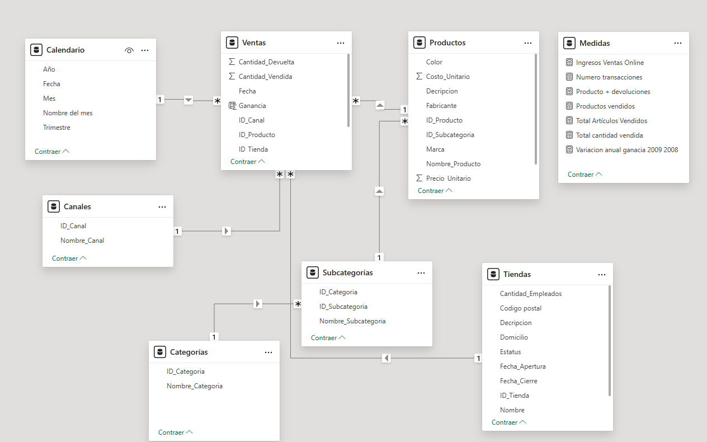

# 📊 Sales Performance & Product Analytics Dashboard

Interactive Power BI dashboard focused on sales performance, profitability analysis, online sales tracking, and product returns through dimensional modeling and KPI monitoring.

---

## 📌 Project Overview

This project combines DAX calculations, star schema modeling, and interactive dashboards to explore commercial performance across products, categories, sales channels, and time periods.

The report enables business-oriented analysis of sales trends, profitability, product margins, and return behavior through interactive KPI reporting and comparative analytics.

---

## 🛠 Tools & Technologies

- Power BI
- Power Query
- DAX
- Star Schema Modeling
- KPI Development
- Sales Analytics
- Interactive Dashboard Design

---

## 📊 Analytical Questions Explored

- How do sales and profits evolve over time?
- Which channels generate the highest profitability?
- Which products produce the highest margins?
- Which categories concentrate the most returns?
- How do online sales compare against other channels?
- Which products combine high sales with high return activity?

---

## 📈 Dashboard Features

- Executive sales KPI dashboard
- Sales and profit analysis
- Online sales tracking
- Year-over-year variation analysis
- Quarterly and monthly trend analysis
- Product margin analysis
- Returns analysis by category and subcategory
- Interactive category and year slicers
- Star schema dimensional model with DAX measures

---

## 🔍 Key Insight

The dashboard reveals a progressive decrease in sales performance over time while identifying categories and products with high margins, strong online sales participation, and concentrated return activity.

---

## 🖼 Dashboard Preview

### Executive Sales Dashboard

---

### Product & Returns Analysis

---

## 🔄 Data Model

---

## 🎯 Key Skills Demonstrated

- DAX calculations
- Star schema modeling
- Sales analytics
- Profitability analysis
- Returns analysis
- KPI development
- Time intelligence
- Interactive dashboard design
- Business intelligence reporting

---

## 🔗 Portfolio

- Notion Portfolio: https://www.notion.so/Sales-Performance-Product-Analytics-Dashboard-2faddeb97846806899e3e65a5824a74b?source=copy_link

